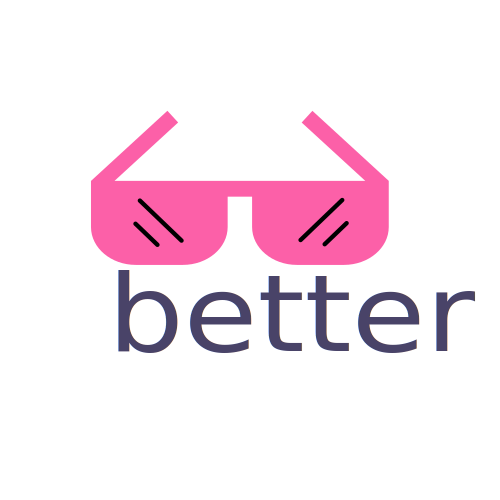

<!-- # better-shadcn-ui -->
<!-- A curated list of better things related to shadcn/ui. -->

<p align="center">
  <br>
  
  <br>
  <br>
</p>

<h2 align='center'>better-shadcn/ui</h2>

<p align='center'>
A curated list of better things related to <a href='https://ui.shadcn.com/' target="_blank">shadcn/ui</a>
<br><br>


## Libs and Components

- [aceternity-ui](https://ui.aceternity.com/) - Copy paste the most trending react components without having to worry about styling and animations.
- [assistant-ui](https://github.com/Yonom/assistant-ui) - React Components for AI Chat.
- [autocomplete-select-shadcn-ui](https://www.armand-salle.fr/post/autocomplete-select-shadcn-ui) - Autocomplete component built with shadcn/ui and Fancy Multi Select by Maximilian Kaske.
- [auto-form](https://github.com/vantezzen/auto-form) - A React component that automatically creates a shadcn/ui form based on a zod schema.
- [capture-photo](https://github.com/UretzkyZvi/capture-photo) - Capture-Photo is a versatile, browser-based React component designed to streamline the integration of camera functionalities directly into your web applications.
- [clerk-elements](https://clerk.com/docs/elements/examples/shadcn-ui) - Composable components that can be used to build custom UIs on top of Clerk's APIs.
- [clerk-shadcn-theme](https://github.com/stormynight9/clerk-shadcn-theme) - Easily synchronize your Clerk `<SignIn />` and `<SignUp />` components with your shadcn/ui styles.
- [confirm-dialog](https://github.com/Aslam97/react-confirm-dialog) - A confirm dialog component built with shadcn/ui.
- [country-state-dropdown](https://github.com/Jayprecode/country-state-dropdown) - This Component is built with Nextjs, Tailwindcss, shadcn/ui & Zustand for state management.
- [cult-ui](https://www.cult-ui.com/) - A well curated set of animated shadcn-style React components for more specific use-cases.
- [credenza](https://github.com/redpangilinan/credenza) - Ready-made responsive modal component for shadcn/ui.
- [date-range-picker-for-shadcn](https://github.com/johnpolacek/date-range-picker-for-shadcn) - Includes multi-month views, text entry, preset ranges, responsive design, and date range comparisons.
- [downshift-shadcn-combobox](https://github.com/TheOmer77/downshift-shadcn-combobox) - Combobox/autocomplete component built with shadcn/ui and Downshift.
- [echo-editor](https://github.com/Seedsa/echo-editor) - A modern WYSIWYG rich-text editor base on tiptap and shadcn/ui
- [edil-ozi](https://edilozi.pro/) - React components for developers. Gsap + framer motion + tailwind.
- [emblor](https://github.com/JaleelB/emblor) - A highly customizable, accessible, and fully-featured tag input component built with shadcn/ui.
- [enhanced-button](https://github.com/jakobhoeg/enhanced-button) - An enhanced version of the default shadcn-button component.
- [fancy-area](https://craft.mxkaske.dev/post/fancy-area) - The Textarea is inspired by GitHub's PR comment section. The impressive part is the @mention support including hover cards in the preview. The goal is to reproduce it without text editor library.
- [fancy-box](https://craft.mxkaske.dev/post/fancy-box) - The Combobox is inspired by GitHub's PR label selector and is powered by shadcn/ui. Almost all elements are radix-ui components, styled with tailwindcss.
- [fancy-multi-select](https://craft.mxkaske.dev/post/fancy-multi-select) - The Multi Select Component is inspired by campsite.design's and cal.com's settings forms.
- [fancy-switch](https://github.com/Aslam97/react-fancy-switch) - A fancy switch component built with shadcn/ui.
- [farmui](https://farmui.com) - A shadcn and tailwindcss based beautifully styled and animated component library solution with its own [npm package](https://www.npmjs.com/package/@kinfe123/farm-ui) to install any component with in a component registery.
- [file-uploader](https://github.com/sadmann7/file-uploader) - A file uploader built with shadcn/ui and react-dropzone.
- [file-vault](https://github.com/ManishBisht777/file-vault) - File upload component for React.
- [fusion-ui](https://github.com/nyxb-ui/ui) - Fusion UI library combining shadcn/ui and MagicUI.
- [ibelick/background-snippet](https://bg.ibelick.com/) - Ready to use collection of modern background snippets.
- [indie-ui](https://github.com/Ali-Hussein-dev/indie-ui) - UI components with variants - [Docs](https://ui.indie-starter.dev)
- [lukacho-ui](https://ui.lukacho.com/components) - Next Generation UI Components
- [magicui](https://magicui.design) - React components to build beautiful landing pages using tailwindcss + framer motion + shadcn/ui
- [maily.to](https://github.com/arikchakma/maily.to) - Craft beautiful emails effortlessly with notion like powerful editor.
- [minimal-tiptap](https://github.com/Aslam97/shadcn-minimal-tiptap) - A minimal WYSIWYG editor built with shadcn/ui and tiptap.
- [mixcnui](https://github.com/taqui-786/mixcnui) - Mixui is a collection of animated or re-usable component currently for Nextjs.
- [mynaui](https://mynaui.com/) - TailwindCSS and shadcn/ui UI Kit for Figma and React.
- [neobrutalism-components](https://github.com/ekmas/neobrutalism-components) - Collection of neobrutalism-styled Tailwind React and Shadcn UI components.
- [nextjs-components](https://components.bridger.to/) - A collection of Next.js components build with TypeScript, React, shadcn/ui, Craft UI, and Tailwind CSS.
- [nextjs-dnd](https://github.com/sujjeee/nextjs-dnd) - Sortable Drag and Drop with Next.js, shadcn/ui, and dnd-kit.
- [novel](https://github.com/steven-tey/novel) - Novel is a Notion-style WYSIWYG editor with AI-powered autocompletion. Built with [Tiptap](https://tiptap.dev/) + [Vercel AI SDK](https://sdk.vercel.ai/docs).
- [password-input](https://gist.github.com/mjbalcueva/b21f39a8787e558d4c536bf68e267398) - shadcn/ui custom password input.
- [phone-input-shadcn-ui](https://www.armand-salle.fr/post/phone-input-shadcn-ui) - Custom phone number component built with shadcn/ui.
- [planner](https://github.com/UretzkyZvi/planner) - Planner is a highly adaptable scheduling component tailored for React applications.
- [plate](https://github.com/udecode/plate) - The rich-text editor for React.
- [pricing-page-shadcn](https://github.com/m4nute/pricing-page-shadcn) - Pricing Page made with shadcn/ui & Next.js 14. Completely customizable.
- [progress-button](https://github.com/tomredman/ProgressButton) - An extension of shadcn/ui button component that uses a state machine to drive a progress UX.
- [react-dnd-kit-tailwind-shadcn-ui](https://github.com/Georgegriff/react-dnd-kit-tailwind-shadcn-ui) - Drag and drop Accessible kanban board implementing using React, dnd-kit, tailwind, and shadcn/ui.
- [search-address](https://github.com/UretzkyZvi/search-address) - The SearchAddress component provides a flexible and interactive search interface for addresses, utilizing the powerful Nominatim service from OpenStreetMap.
- [shadcn-address-autocomplete](https://github.com/NiazMorshed2007/shadcn-address-autocomplete) - An address autocomplete component built with Google Places API and shadcn components.
- [shadcn-blocks](https://ui.shadcn.com/blocks) - Blocks is the official shadcn/ui pre-made but customizable components that can be copied and pasted into your projects.
- [shadcn-cal](https://shadcn-cal-com.vercel.app/?date=2024-04-29) - A copy of the monthly calendar used by Cal.com with shadcn/ui, Radix Colors and React Aria.
- [shadcn-calendar-heatmap](https://shadcn-calendar-heatmap.vercel.app/) - Modern alternative to primitive react heatmaps built on top of shadcn/ui calendar component.
- [shadcn-calendar-component](https://github.com/sersavan/shadcn-calendar-component) - A calendar date picker component designed with shadcn/ui.
- [shadcn-chat](https://github.com/jakobhoeg/shadcn-chat) - Customizable and reusable chat component for you to use in your projects.
- [shadcn-data-table-advanced-col-opions](https://github.com/danielagg/shadcn-data-table-advanced-col-opions) - Column-resizing option to shadcn/ui DataTable.
- [shadcn-drag-table](https://github.com/zenoncao/shadcn-drag-table) - A drag-and-drop table component using shadcn/ui and Next.js.
- [shadcn-extends](https://github.com/lucioew28/extends) - Intended to be a collection of components built using shadcn/ui.
- [shadcn-extension](https://github.com/BelkacemYerfa/shadcn-extension) - An open-source component collection that extends your UI library, built using shadcn/ui components.
- [shadcn-image-cropper](https://github.com/sujjeee/shadcn-image-cropper) - A minimal image cropper UI built with shadcn and the react-image-crop library.
- [shadcn-linear-combobox](https://github.com/damianricobelli/shadcn-linear-combobox) - A copy of the combobox that Linear uses to set the priority of a task.
- [shadcn-multi-select-component](https://github.com/sersavan/shadcn-multi-select-component) - A multi-select component designed with shadcn/ui.
- [shadcn-phone-input-2](https://github.com/damianricobelli/shadcn-phone-input) - Simple and formatted phone input component built with shadcn/ui y libphonenumber-js.
- [shadcn-phone-input](https://github.com/omeralpi/shadcn-phone-input) - Customizable phone input component with proper validation for any country.
- [shadcn-stepper](https://github.com/damianricobelli/shadcn-stepper) - A complete stepper component built with shadcn/ui.
- [shadcn-table-v2](https://github.com/sadmann7/shadcn-table) - shadcn/ui table component with server-side sorting, filtering, and pagination.
- [shadcn-timeline](https://github.com/timDeHof/shadcn-timeline) - Customizable and re-usable timeline component for you to use in your projects. Built on top of shadcn.
- [shadcn-ui-blocks](https://shadcn-ui-blocks.vercel.app/) - A collection of Over 10+ fully responsive, UI blocks you can drop into your Shadcn UI projects and customize to your heart's content.
- [shadcn-ui-expansions](https://github.com/hsuanyi-chou/shadcn-ui-expansions) - A lots of useful components which shadcn/ui does not have out of the box.
- [shadcn-ui-sidebar](https://github.com/salimi-my/shadcn-ui-sidebar) - A stunning, functional and responsive retractable sidebar built on top of shadcn/ui.
- [sortable](https://github.com/sadmann7/sortable) - A sortable component built with shadcn/ui, radix ui, and dnd-kit.
- [stocks](https://github.com/aryanvichare/stocks) - Stock Picker using Next.js, React Server Components, and shadcn/ui charts.
- [time-picker](https://github.com/openstatusHQ/time-picker) - A simple TimePicker for your shadcn/ui project.
- [tremor-raw](https://github.com/tremorlabs/tremor-raw) - Copy & paste React components to build modern web applications. Good for building charts.
- [uixmat/onborda](https://github.com/uixmat/onborda) - Give your application the onboarding it deserves with Onborda product tour for Next.js

## Apps

### Plugins and Extensions

- [chat-with-youtube](https://chat-with-youtube.vercel.app/) - A chrome extension is designed to give you the ability to efficiently summarize videos, easily search for specific parts, and enjoy additional useful features.
- [designgui](https://www.designgui.io/) - A Chrome Browser Extension for managing colors in CSS Variables.
- [raycast-shadcn](https://www.raycast.com/luisFilipePT/shadcn-ui) - Raycast extension to Browse shadcn/ui documentation, components and examples
- [shadcn-ui](https://marketplace.visualstudio.com/items?itemName=SuhelMakkad.shadcn-ui) - Add components from shadcn/ui directly from VS Code.
- [shadcn/ui Components Manager](https://plugins.jetbrains.com/plugin/23479-shadcn-ui-components-manager) - A plugin for Jetbrain products. It allows you to manage your shadcn/ui components across Svelte, React, Vue, and Solid frameworks with this plugin. Simplify tasks like adding, removing, and updating components.
- [vscode-shadcn-svelte](https://marketplace.visualstudio.com/items?itemName=Selemondev.vscode-shadcn-svelte&ssr=false#overview) - VS Code extension for shadcn/ui components in Svelte projects.
- [vscode-shadcn-ui-snippets](https://marketplace.visualstudio.com/items?itemName=VeroXyle.shadcn-ui-snippets) - Easily import and use shadcn-ui components with ease using snippets within VSCode. Just type cn or shadcn in you jsx/tsx file and you will get a list of all the components to choose from.
- [vscode-shadcn-vue](https://marketplace.visualstudio.com/items?itemName=Selemondev.vscode-shadcn-vue) - Extension for integrating shadcn/ui components into Vue.js projects.

### Colors and Customizations

- [10000+Themes for shadcn/ui](https://ui.jln.dev/) - 10000+ Themes for shadcn/ui.
- [dizzy](https://dizzy.systems/) - Bootstrap a new Next or Vite project with shadcn/ui. Customize font, icons, colors, spacing, radii, and shadows.
- [gradient-picker](https://github.com/Illyism/gradient-picker) - Fancy Gradient Picker built with Shadcn UI, Radix UI and Tailwind CSS.
- [navnote/rangeen](https://github.com/navnote/rangeen) - Tool that helps you to create a colour palette for your website
- [shadcn-ui-customizer](https://github.com/Railly/shadcn-ui-customizer) - POC - shadcn/ui themes with color pickers
- [ui-colorgen](https://ui-colorgen.vercel.app/) - An application designed to assist you with color configuration of shadcn/ui.
- [zippy starter's shadcn/ui theme generator.](https://zippystarter.com/tools/shadcn-ui-theme-generator) - Easily create custom themes from a single colour that you can copy and paste into your apps.

### Animations

- [magicui.design](https://magicui.design) - Largest collection of open-source react components to build beautiful landing pages.
- [motionvariants](https://github.com/chrisabdo/motionvariants) - Beautiful Framer Motion Animations.

### Tools

- [5devs](https://www.5devs.com.br/) - A website to get fake brazilian data for testing purposes.
- [cut-it](https://github.com/mehrabmp/cut-it) - Link shortener built using Next.js App Router, Server Actions, Drizzle ORM, Turso and styled with shadcn/ui
- [CV Forge](https://cvforge.app) - Resume builder, build with @shadcn/ui, react-hook-form and react-pdf
- [form-builder](https://github.com/AlandSleman/FormBuilder) - UI based codegen tool to easily create Beautiful and Type safe @shadcn/ui forms.
- [imgsrc](https://imgsrc.io/) - Generate beautiful Open Graph images with zero effort.
- [invoify](https://github.com/aliabb01/invoify) - An invoice generator app built using Next.js, Typescript, and shadcn/ui
- [pastecode](https://github.com/Quorin/PasteCode.app) - Pastebin alternative built with Typescript, Next.js, Drizzle, Shadcn, RSC
- [QuackDB](https://github.com/mattf96s/QuackDB) - Open-source in-browser DuckDB SQL editor
- [shadcn-pricing-page-generator](https://shipixen.com/shadcn-pricing-page) - The easiest way to get a React pricing page with shadcn/ui, Radix UI and/or Tailwind CSS.
- [translate-app](https://github.com/developaul/translate-app) - Translate App using TypeScript, Tailwind CSS, NextJS, Bun, shadcn/ui, AI-SDK/OpenAI, Zod
- [typelabs](https://github.com/imsandeshpandey/typelabs) - MonkeyType inspired typing test app built with React, shadcn, and Zustand at it's core.
- [v0](https://v0.dev/) - Vercel's generative UI system, built on shadcn/ui and TailwindCSS, allows effortless UI generation from text prompts and/or images. It produces React and HTML code, integration is also possible via v0 CLI command.
- [Xuneix](https://xuneix.theteleporter.me/) - A link rotation tool for enhanced admin panel security. It includes dynamic URLs, expiring tokens, customizable rotation. Easily setup with Shadcn UI. Integrates with Vercel KV.

## Platforms

- [bolhadev](https://bolhadev.chat/) - The quickest path to learn English is speaking it regularly. Just find someone to chat with.
- [enjoytown](https://github.com/avalynndev/enjoytown) - A free anime, manga, movie, tv-shows streaming platform. Built with Nextjs, shadcn/ui
- [Grade Calculator](https://grades.nstr.dev/) - A grade calculator/dashboard for students, aiming to provide a better overview on the academic performance.
- [infinitunes](https://github.com/rajput-hemant/infinitunes) - A Simple Music Player Web App built using Next.js, shadcn/ui, Tailwind CSS, DrizzleORM and more...
- [kd](https://github.com/gneiru/kd) - Ad-free Kdrama streaming app. Built with Nextjs, Drizzle ORM, NeonDB and shadcn/ui
- [plotwist](https://plotwist.app/en-US) - Easy management and reviews of your movies, series and animes using Next.js, Tailwind CSS, Supabase and shadcn/ui.

## Ports

- [Angular](https://github.com/goetzrobin/spartan) - Angular port of shadcn/ui
- [Flutter](https://github.com/nank1ro/shadcn-ui) - Flutter port of shadcn/ui
- [Franken UI](https://www.franken-ui.dev/) - HTML-first, framework-agnostic, beautifully designed components that you can truly copy and paste into your site. Accessible. Customizable. Open Source.
- [JollyUI](https://github.com/jolbol1/jolly-ui) - shadcn/ui compatible react aria components
- [Kotlin](https://github.com/dead8309/shadcn-kotlin) - Kotlin port of shadcn/ui
- [Phoenix Liveview](https://github.com/bluzky/salad_ui) - Phoenix Liveview port of shadcn/ui
- [React Native](https://github.com/Mobilecn-UI/nativecn-ui) - React Native port of shadcn/ui
- [React Native](https://github.com/mrzachnugent/react-native-reusables) - React Native port of shadcn/ui (recommended)
- [Ruby](https://github.com/aviflombaum/shadcn-rails) - Ruby port of shadcn/ui
- [Solid](https://github.com/hngngn/shadcn-solid) - Solid port of shadcn/ui
- [Svelte](https://github.com/huntabyte/shadcn-svelte) - Svelte port of shadcn/ui
- [Swift](https://github.com/Mobilecn-UI/swiftcn-ui) - Swift port of shadcn/ui
- [Vue](https://github.com/radix-vue/shadcn-vue) - Vue port of shadcn/ui

## Design System

- [shadcn-ui-components](https://www.figma.com/community/file/1342715840824755935/shadcn-ui-components) - Every component recreated in Figma.
- [shadcn-ui-storybook](https://65711ecf32bae758b457ae34-uryqbzvojc.chromatic.com/) - All shadcn/ui components registered in the storybook by [JheanAntunes](https://github.com/JheanAntunes/storybook-shadcn)
- [shadcn-ui-storybook](https://fellipeutaka-ui.vercel.app/?path=/docs/components-accordion--docs) - All shadcn/ui components registered in the storybook by [fellipeutaka](https://github.com/fellipeutaka/ui)

## Boilerplates / Templates

- [chadnext](https://github.com/moinulmoin/chadnext) - Quick Starter Template includes Next.js 14 App router, shadcn/ui, LuciaAuth, Prisma, Server Actions, Stripe, Internationalization and more.
- [design-system-template](https://github.com/arevalolance/design-system-template) - Turborepo + TailwindCSS + Storybook + shadcn/ui
- [electron-shadcn](https://github.com/LuanRoger/electron-shadcn) - Electron app template with shadcn/ui and a bunch of other libs and tools ready to use.
- [horizon-ai-nextjs-shadcn-boilerplate](https://horizon-ui.com/boilerplate-shadcn) - Premium AI NextJS & Shadcn UI Boilerplate + Stripe + Supabase + OAuth
- [kirimase](https://kirimase.dev/) - A template and boilerplate for quickly starting your next project with shadcn/ui, Tailwind CSS, and Next.js.
- [magicui-startup-templates](https://magicui.design/docs/templates/startup) - Magic UI Startup template built using shadcn/ui + tailwindcss + framer-motion
- [next-shadcn-dashboard-starter](https://github.com/Kiranism/next-shadcn-dashboard-starter) - Admin Dashboard Starter with Next.js 14 and shadcn/ui
- [nextjs-mdx-blog](https://github.com/ChangoMan/nextjs-mdx-blog) - Starter template built with Contentlayer, MDX, shadcn/ui, and Tailwind CSS.
- [shadcn-landing-page](https://github.com/leoMirandaa/shadcn-landing-page) - Landing page template using shadcn/ui, React, Typescript and Tailwind CSS
- [shadcn-landing-page](https://github.com/nobruf/shadcn-landing-page) - Project conversion [shadcn-vue-landing-page](https://github.com/leoMirandaa/shadcn-vue-landing-page) to nextjs - Landing page template using Nestjs, shadcn/ui, TypeScript, Tailwind CSS
- [shadcn-nextjs-free-boilerplate](https://github.com/horizon-ui/shadcn-nextjs-boilerplate) - Free & Open-source NextJS Boilerplate + ChatGPT API Dashboard Template
- [shadcn-vue-landing-page](https://github.com/leoMirandaa/shadcn-vue-landing-page) - Landing page template using Vue, shadcn-vue, TypeScript, Tailwind CSS
- [t3-app-template](https://github.com/gaofubin/t3-app-template) - This is the admin template for T3 Stack and shadcn/ui
- [taxonomy](https://github.com/shadcn/taxonomy) - An open source application built using the new router, server components and everything new in Next.js
- [turborepo-shadcn-ui-tailwindcss](https://github.com/henriqpohl/turborepo-shadcn-ui-tailwindcss) - Turborepo starter with shadcn/ui & Tailwind CSS pre-configured for shared ui components.
- [turborepo-launchpad](https://github.com/JadRizk/turborepo-launchpad) - A comprehensive monorepo boilerplate for shadcn projects using Turbo. It features a highly scalable setup ideal for developing complex applications with shared components and utilities.
- [Supabase authentication starter template](https://github.com/Sahil-Sharma-23/supa-next-shad-auth) - A fully responsive, fully type safe, secure server actions, user friendly customizable UI with following best practices. Tech used: NextJS + Supabase + TypeScript + Server Actions + Zod + ShadCN-UI.

## 

<!-- # This is the most useless file in this codebase so feel free to just check some real codes in this codebase. -->
# So, as you are already here then hear me out. This is the most funny story related to shadcn/ui, I guess. 
### Time of the Event: (12/07/2024 - 09:25:18pm) -> Also included seconds and realized it after pushing it. So I decided to keep it.

**So, I've been following shadcn/ui since its early days, even before it gained mainstream popularity. I knew this component library had the potential to become a major player, and I was right. As of writing, it has already surpassed 62k stars on GitHub, which is a fantastic achievement for a component library, especially a React one competing against established names like:**

1. Material UI (92.5k)
2. Ant Design (91.5k)
3. NextUI (20.6k) (Highly Underrated Library! Don't be discouraged by its star count. The components it provides rival those of the top two.)
4. Bootstrap (22.3k) (Good enough)
5. And so on...

You get the idea, right? This Shadcn guy is a true legend. Fun fact: I actually started using Twitter (or X) just to follow him.

By now, you can probably tell that I'm a huge fan of shadcn/ui. As I mentioned, I've been following the library since its inception. I was really interested in contributing one of my own components. I managed to create a cross-browser scrollbar and update the code sections for dark themes. However, at that time, I wasn't comfortable using Tailwind because I prefer good ol' CSS. (Hey, no judgment here, I love CSS too!) While I knew about Tailwind, I wasn't comfortable using it yet.

Despite having everything ready and creating a pull request, I ultimately didn't contribute to the library at that time. Back then, shadcn reviewed code submissions himself, and looking back, I realize I used hex colors when shadcn/ui utilizes HSL CSS variables. My unfamiliarity with Tailwind also played a role in not updating the code. Then, with my studies taking priority, 2023 passed by in a blur.

The first few months of 24 were similar, filled with academic commitments that kept me away from coding for a while. Once exams were over, I decided to try freelancing to earn some money. Unfortunately, it wasn't a smooth experience. Being from Bangladesh, Fiverr is arguably the most popular freelancing platform. However, back in 2022, while learning about Blockchain technology, I got my Fiverr account banned due to my lack of experience. A rookie mistake – I asked a client to use a payment method outside of Fiverr's system. This, of course, led to the ban. Discouraged by this experience, I decided to take a break from freelancing.

But then, in 2024, I was suddenly hit with the motivation to freelance again. (Let's just say Vitamin "M" deficiency played a part.) After my college exams ended in June, I realized I couldn't create a new Fiverr account due to the ban. Upwork, another well-known platform, became my next option. I had tried Upwork before in 2022 but hadn't received any client messages, so I stopped using it. This time, however, after two months of hard work, I managed to complete two projects for a measly $100. To make matters worse, I even got really sick during this period. Despite finishing the projects and delivering good results, I wasn't offered any further work. Talk about getting cheated!

Feeling defeated, I considered giving up freelancing again and focusing on personal projects and studies, especially since my last exams weren't ideal.

That's when I remembered my old goal of contributing to shadcn/ui. I wasn't surprised to learn that shadcn/ui had become incredibly popular in the meantime. Now, I'm determined to give contributing another shot.

**Here's to trying again! We all make mistakes, but the key is to laugh it off and keep moving forward.**

Thanks for listening to my not-so-boring story about my journey with shadcn/ui.

**ManFromExistence (Peace out + Hacking/Signing OUT + Sayonara)**
<!-- 
Story:
So, I followed shadcn/ui from the time it was not so popular but still it was so cool and beautiful. I knew this component library will definetly blow the current component library race. Yeah, I was right. It surely did, as the time I am writing this story it already crossed over 62k github stars which is a great feed for a component library specially React component library which already has some tough competetions like:
1. Material ui(92.5k)
2. Ant design(91.5k)
3. Nextui(20.6k) -> Highly Underrated Library! Don't worry about this component libray's stars. The component's this ui libray proviedes is still close to those top 2. 
4. Bootstrap(22.3k) -> Good enough
5. And so on...
You get the idea right. This Shadcn guy is truly legend. Fun Fact I myself started using Twitter or X just to follow this man.
So, from this you can relate that I like this legend a lot. So, as I already told I was following this library from start. And I really wanted to add one of my own made components in this component ui library. I managed to add a all browser based scrollbar and updated code sections for dark theme. But, at that time I was not comfortable using Tailwind cause I love CSS. Yeah, that's true. Don't ask me how but I love CSS. And I knew Tailwind but at that time a I was not much comfortale using Tailwind. So, despite doing all the things and making a pull request. I didn't made to contribute anythign to this library at that time. Cause, at that time shadcn was free and he himself cheaked my codebase. And yeah, I can that I used hex colors when in shadcn/ui they were using hsl css variables as I was not comfortable using Tailwind. So, that's why I didn't updated that code. And then, I was busy in my studies and this way 2023 overed. In 2024, in first couple of months I was still busy in my studies and didn't done any coding for so many time. And after my exams are cleared I choose to do freelancing to earn some money. And ohh, It was not a pleasant expreince. Cause, I am from Bangladesh. And the best freelancing platform from this country is argubly FIVERR. But in 2022, when I am learing Blockchian Technology and at that time I was also doing Freelancing on Fiverr. For, lack of freelance experience I got my FIVERR account BANNED. And that my friend also indeed was a unpleasant experience. Its not something that I done something wrong but at that time I didn't some simple things like it is bad to ask a client to pay by using other payment method other than FIVERR. And for this lack of experience I was BANNED from Fiverr. So, suffering that I choose not to do freelancing for some time. But, I in 2024 I suddently got motivated to do freelancing for magically. Ohh, my bad it is same old problem. The lack of Vitamin "M". So, around June after my collage exams was over. As, I can't create a new Fiverr account I found that Upwork is also quite famause as a freelance platform. So, I have no choice but to create a new Upwork seller account. I once also tried Upwork before in 2022 but didn't even got any client messages so I stopped using this platform. Currently, I managed to get 2 jobs done by doing 2 months of hard works for only 100$. And in this time I got so sick that I barely survied from death. But, still when I told my Client. The Client was like "Is my project ready or not?" LOL

I being a Nextjs, Fullstack develper was payed only 100$ doing extreme hard work for 2 months. Like how bad my luck can be, And I done their jobs in that low amount of money only to get new projects from them. But, despite putting my all and end result also good enough but still I didn't any new projects. Yeah, I clreary got cheated here.

So, after suffering this I was like 'I will again stop doing freelancing and for now will do my own side projects and focus on my studies cause my last exams was not so good'

Then, I remembered about my old goal to contribute to Shadcn/ui. I didn't got surprised to know that Shadcn/ui is already became so popular. So, now I will do a second try to contribute to shadcn/ui.

```
So, I was totally in love with this code library, right? Like, way more than was normal. But then this other thing called Tailwind came along, and I freaked. Freaked out big time!

Freelancing turned into a disaster too. Got banned from one site, made peanuts on another. Big yikes!

But guess what? I went crawling back to my code library love. Just couldn't stay away! The lesson here? We all mess up, but gotta laugh at ourselves and try again. Here's to next time!
```

Thanks for listning my not so interesting story about my feeling shadcn/ui. 

This is => ManFromExistence(Peace out + Hacking/Signing OUT + Sayonara) -->
